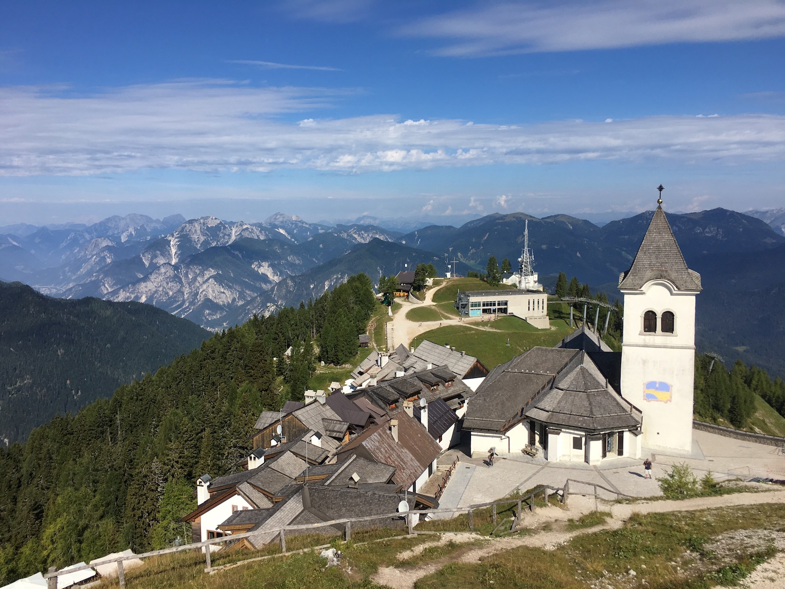

# AlexNet training on ImageNet LSVRC 2012

As part of a university project I implemented AlexNet model and its training and testing procedures on the ILSVRC 2012 dataset, all using TensorFlow. 


### Training
To train AlexNet just run the command:
```shell
python train.py option
``` 
with options ```-scratch``` to train the model from scratch or ```-resume``` to resume the training from a checkpoint.

I trained AlexNet with the hyperparameters set in the script for ~46000 steps (roughly 46 epochs), decreasing the learning rate two times (by a factor of 10) when the loss became stagnant. The training image were preprocessed subtracting the training-set mean for each channel. No data-augmentation was performed (future improvement). The training was carried on a NVIDIA Tesla K40c (thanks to [Avires Lab](https://https://avires.dimi.uniud.it)) and took a few days.


### Testing
To evaluate the accuracy of the trained model I used the ILSVRC validation set (no test set is available). Run simply:
```shell
python train.py
```
This evaluates *Top-1* and *Top-k* (you can set *k* inside the script) accuracy and error-rate.
Inside the script you can also play with the ```K_CROPS``` parameter to see how the accuracy change when the predictions are averaged through different random crops of the images.

I tested the trained model on the ILSVRC validation set consisting of 50000 images. I obtained a *Top-1* accuracy of **57.31%** and a *Top-5* accuracy of **80.31%**, averaging the predictions on 5 random crops. With more epochs and some tweaks they can be improved of a few more points. I hope to do so in the next weeks.


### Classify an image
To predict the classes of an input image run:
```shell
python classify.py image
```
where ```image``` is the path of the image you want to classify.

e. g. that command on the ```lussari.jpg``` image 

gives the output:
```shell
AlexNet saw:
alp - score: 0.575796604156
church, church building - score: 0.0516746938229
valley, vale - score: 0.0432425364852
castle - score: 0.0284509658813
monastery - score: 0.0265731271356
```
Again, you can change the number of random crops produced and the *Top-k* prediction retrieved (here are both `5`).


### Notes
```train.py``` and ```test.py``` scripts assume that ImageNet dataset folder is structured in this way:
```
ILSVRC2012
    ILSVRC2012_img_train
        n01440764
        n01443537
        n01484850
        ...
    ILSVRC2012_img_val
        ILSVRC2012_val_00000001.JPEG
        ILSVRC2012_val_00000002.JPEG
        ...
    data
        meta.mat
        ILSVRC2012_validation_ground_truth.txt
```


#### References
+ *Alex Krizhevsky, Ilya Sutskever and Geoffrey E. Hinton.* ImageNet Classification with Deep Convolutional Neural Networks. Advances in Neural Inforamtion Processing Systems 25, 2012.
+ *Olga Russakovsky°, Jia Deng°, Hao Su, Jonathan Krause, Sanjeev Satheesh, Sean Ma, Zhiheng Huang, Andrej Karpathy, Aditya Khosla, Michael Bernstein, Alexander C. Berg and Li Fei-Fei.* (° = equal contribution) ImageNet Large Scale Visual Recognition Challenge. IJCV, 2015